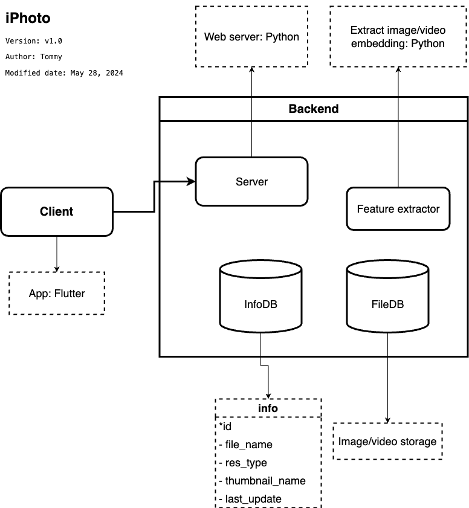
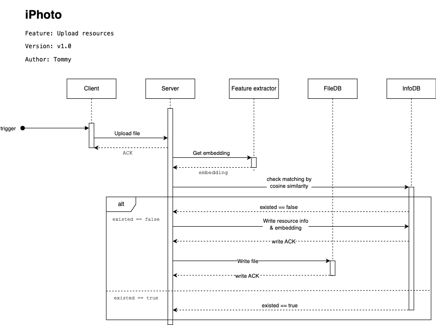

# iPhoto

## 1. Introduction

_iPhoto_ is a full-stack app leveraging image or video display (in front-end) and storing (in back-end).

### 1.1. System architecture

#### a. Client

Client is an

#### b. Web server

#### c. Feature Matcher

#### d. InfoDB

#### e. FileDB

### 1.2. System sequence diagram

## 2. Client

**Flutter** is used to develop smartphone application.
Please visit this branch [Client](https://github.com/tommyjohn1001/iphoto/tree/FE) for more information.

## 3. Server

At first, **Python** is used to develop server side, but as I was introduced about _Golang_, I was totally persuaded. Not only the elegance but also the speed, the siplicity surprise me a lot.

Please visit this branch [Server](https://github.com/tommyjohn1001/iphoto/tree/BE/server-golang) for more information.
